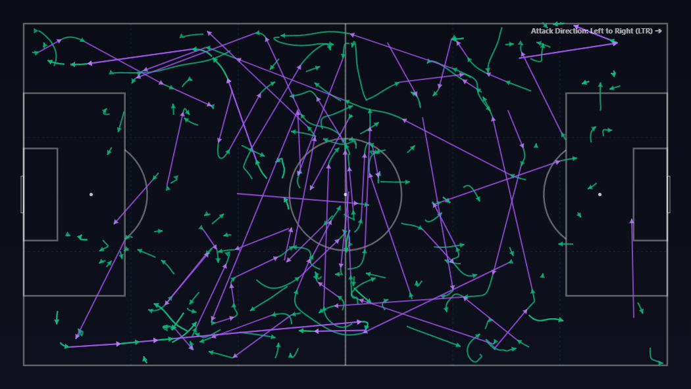

# Metrica EPTS Tactical Radar Visualizer

An advanced sports analytics and tactical visualization platform that synchronizes automatic tracking telemetry (ATD) and Sportscode tactical events onto a high-performance interactive 2D radar web application, complete with a synchronized broadcast video player.

> [!IMPORTANT]
> **Prototype Notice & Production Roadmap**:
> This project is currently a **proof-of-concept prototype** that utilizes pre-recorded match video telemetry processed offline via the **Metrica Nexus / Metrica Sports** ecosystem.
> 
> In the definitive production version, the system will implement an end-to-end **Computer Vision pipeline** (enabling automated field calibration, real-time object detection, and player/ball tracking). This pipeline will capture and stream telemetry directly from a **live broadcast feed source** in real time, replacing the current offline pre-tracked dataset workflow from Metrica Nexus.

---

## 📈 Data Acquisition from Metrica Nexus

The telemetry assets used in this prototype were acquired from **Metrica Sports / Metrica Nexus** using the following workflow:

1. **Video Ingestion & Processing**: The full-match raw broadcast video (`DEMO_1001_FULLMATCH.mp4`) was processed in the Metrica Cloud environment. Automated computer vision algorithms (field calibration, player detection, and track generation) processed the footage frame-by-frame.
2. **Automatic Tracking Data (ATD) Generation**: Camera-compensated tracking telemetry was computed based on continuous player tracks, extracting normalized $(X, Y)$ coordinates $(0.0 - 1.0)$, instantaneous speeds, and ball position at 25 FPS.
3. **FIFA EPTS Export**: Telemetry and session metadata were exported in standardized **FIFA EPTS (Electronic Performance and Tracking Systems)** formats:
   * **`DEMO_1001_FULLMATCH_FifaData.xml` (Metadata)**: Pitch specifications ($105 \times 68$ meters), frame rate ($25.0$ FPS), period timestamps, team assignments, and tracking configurations.
   * **`DEMO_1001_FULLMATCH_FifaDataRawData.txt` (Telemetry)**: Tab-separated telemetry containing coordinate tracks, velocities, and status flags.
4. **Sportscode Event Tagging**: Tactical match events tagged in Sportscode were exported in XML format (`DEMO_1001_FULLMATCH_pattern.xml`), supplying clip start/end timestamps for tactical categories such as *Build Up*, *Progression*, and *Attacking Transitions*.

---

## 🐍 Data Science Pipeline (Scripts)

To efficiently process high-density tracking datasets on standard hardware (e.g. 8GB RAM), the Python scripts in `scripts/` utilize Pandas and release unneeded memory buffers immediately:

* **[extract_attacking_transitions.py](scripts/extract_attacking_transitions.py)**: Filters full match tracking telemetry down to targeted tactical clip frames.
* **[calculate_metrics.py](scripts/calculate_metrics.py)**: Computes cumulative distances covered in meters, player speeds, team centroids (center of mass), and dispersion metrics.
* **[detect_passes.py](scripts/detect_passes.py)**: Evaluates player-ball spatial geometry to detect possession touches and classify successful pass vectors.
* **[detect_progressions.py](scripts/detect_progressions.py)**: Tracks ball carries and progressive runs across match phases.
* **[prepare_radar_data.py](scripts/prepare_radar_data.py)**: Bundles telemetry, metrics, passes, and carries into chunked, lightweight JSON files per clip (~100KB each) inside the web app static data directory.

---

## 💻 Web App Setup & Installation

The interactive tactical visualizer is a modern dashboard built with **Vite + React** and **HTML5 Canvas** for fluid 25 FPS animations.

### Prerequisites
* **Node.js** (v18 or higher)
* **npm** (v10 or higher)

### Setup & Run
1. Navigate to the client folder and install dependencies:
   ```bash
   cd radar-app
   npm install
   ```
2. Start the local server:
   ```bash
   npm run dev
   ```
3. Open [http://localhost:5173/](http://localhost:5173/) in your web browser.

### 🎥 Broadcast Video Streaming & Seek Sync
To stream broadcast video assets directly from the local environment, the Vite configuration ([vite.config.js](radar-app/vite.config.js)) incorporates custom dev server middleware supporting **HTTP Range Requests**. 

This allows the browser HTML5 video player to seek and stream video chunks seamlessly, keeping `currentTime` synchronized with frame indices in the 2D radar visualizer.

---

## 🎬 Visual Showcase & Tactical Analysis

### 🎥 Interactive Dashboard & Synchronized Radar Demos
The application provides real-time synchronization between broadcast video footage and a high-performance 2D radar visualizer:

<table>
  <tr>
    <td width="50%" align="center">
      <b>Attacking Transition Demo (#293)</b><br/>
      <video src="media/Attacking%20Transition%20%23293.mp4" controls width="100%"></video>
    </td>
    <td width="50%" align="center">
      <b>Defense Middle Third Demo (#462)</b><br/>
      <video src="media/Defense%20Middle%20Third%20%23462.mp4" controls width="100%"></video>
    </td>
  </tr>
</table>

*The video player automatically syncs frame indices with player tracking telemetry, displaying real-time team centroids, line distances, and physical performance metrics.*

---

### 📊 Tactical Simplification: Raw Vectors vs. Dominant Flows
Without spatial corridor aggregation, raw event vectors can create visual clutter. The **Dominant Flows** engine reorganizes complex pass and carry trajectories into clear, aggregated build-up corridors:

| Raw Vector Plot (Unprocessed) | Dominant Flows (Corridor Aggregation) |
| :---: | :---: |
|  |  |
| *Displays every individual pass and carry vector without spatial grouping, which can obscure strategic patterns.* | *Simplifies complex trajectories into top directional channels with side-by-side carry/pass volume indicators and zone cardinality shading.* |